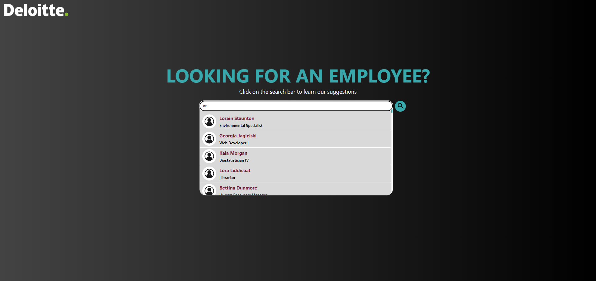

# Deloitte Project



## Installation
1. Clone the repository
```bash
git clone https://github.com/or-meisson/autocomplete-engine.git
```
2. Change the working directory
```bash 
cd autocomplete-engine
```
3. Install dependencies
```bash
cd server && npm install
cd client && npm install
```
4. Run the server
```bash
cd server && npm start
```
5. Run the client
```bash
cd client && npm start
```
